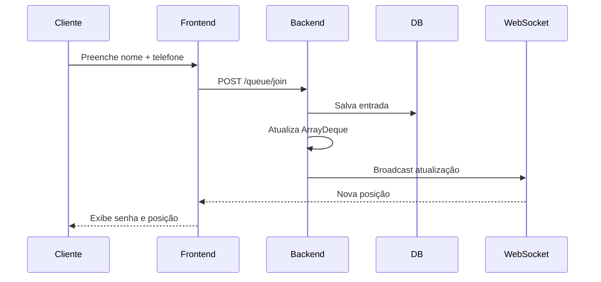
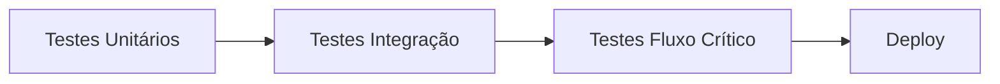

# ✂️ NextCut — Fila Virtual para Barbearia

<div align="center">

## 🚀 Modernizando o atendimento da barbearia com tecnologia em tempo real

### Transforme o antigo caderno físico em uma experiência digital inteligente, rápida e profissional.


</div>

---

# 📌 Sobre o Projeto

**NextCut** é uma plataforma web de fila virtual em **fase de planejamento e design** para barbearias que desejam abandonar métodos manuais e oferecer uma experiência moderna aos clientes.

> 🎯 **Estado Atual**: Documento de especificação e arquitetura. Implementação em breve.

## 🎯 Problema Resolvido
### Antes:
- Caderno físico
- Confusão na ordem
- Cliente preso no local
- Falta de previsibilidade
- Gestão manual

### Depois:
- Entrada via link
- Fila em tempo real
- Senha automática
- Acompanhamento remoto
- Painel administrativo

---

# 🌟 Principais Funcionalidades

## 👤 Cliente
- Entrar na fila com nome + telefone
- Receber senha sequencial automática
- Acompanhar posição em tempo real
- Ver estimativa de espera
- Sair da fila

## 💈 Barbeiro (Admin)
- Login seguro
- Visualizar fila completa
- Chamar próximo cliente
- Remover clientes
- Abrir/Fechar atendimento
- Ajustar tempo médio de serviço

---

# 🧠 Arquitetura do Sistema

```mermaid
flowchart LR
    A[Cliente / Barbeiro Frontend React] --> B[HTTP REST API]
    A --> C[WebSocket Tempo Real]
    B --> D[Javalin Controllers]
    C --> E[WebSocket Manager]
    D --> F[Service Layer]
    E --> F
    F --> G[DAO Layer]
    G --> H[(Supabase PostgreSQL)]
````

---

# 🏗️ Clean Architecture

```mermaid
flowchart TD
    UI[Frontend React] --> Controller
    Controller --> Service
    Service --> DAO
    DAO --> Database[(Supabase)]
    Service --> QueueMemory[(ArrayDeque FIFO)]
```

---

# 📂 Estrutura de Pastas

```bash
nextcut/
│
├── frontend/
│   ├── src/
│   │   ├── pages/
│   │   ├── components/
│   │   ├── hooks/
│   │   ├── context/
│   │   ├── services/
│   │   ├── routes/
│   │   ├── utils/
│   │   └── tests/
│
├── backend/
│   ├── src/main/java/com/nextcut/
│   │   ├── controller/
│   │   ├── service/
│   │   ├── dao/
│   │   ├── model/
│   │   ├── websocket/
│   │   ├── config/
│   │   └── util/
│   │
│   └── src/test/
│
└── docs/
```

---

# ⚙️ Stack Tecnológica

## 🎨 Frontend

* React JS
* Vite
* TailwindCSS
* Axios
* React Router
* Context API
* WebSocket

## 🛠️ Backend

* Java 17+
* Javalin
* Maven
* JDBC
* BCrypt
* JUnit
* Mockito

## 🗄️ Banco de Dados

* Supabase PostgreSQL
* Supabase Auth
* Supabase Realtime

---

# 🔁 Fluxo Principal do Sistema



---

# 📋 Regras de Negócio

## 🔒 Regras Obrigatórias

* FIFO (First In, First Out)
* Senha sequencial
* Telefone único
* Cliente não duplica
* Apenas admin gerencia fila
* Atualização em tempo real
* Persistência híbrida (memória + banco)

---

# 🗃️ Modelagem de Dados

## Tabela: `barber`

| Campo               | Tipo      |
| ------------------- | --------- |
| id                  | UUID      |
| username            | VARCHAR   |
| password_hash       | TEXT      |
| avg_service_minutes | INT       |
| is_open             | BOOLEAN   |
| created_at          | TIMESTAMP |

## Tabela: `queue_entries`

| Campo         | Tipo      |
| ------------- | --------- |
| id            | UUID      |
| ticket_number | INT       |
| client_name   | VARCHAR   |
| client_phone  | VARCHAR   |
| status        | VARCHAR   |
| position      | INT       |
| entered_at    | TIMESTAMP |
| called_at     | TIMESTAMP |

---

# 🌐 Endpoints da API

> Estado atual: backend base criado com Javalin e fila em memória. A integração JDBC/Supabase fica para depois da atividade #7, quando as tabelas estiverem prontas.

## Cliente

```http
GET /
POST /queue/join
GET /queue/status/{phone}
POST /queue/leave/{phone}
```

## Admin

```http
POST /login
POST /admin/next
POST /admin/remove/{id}
POST /admin/toggle
```

## WebSocket

```http
/ws/queue
```

## Rodar o backend localmente

Pré-requisitos:

* Java 17+
* Maven 3.9+

```bash
cd backend
mvn test
mvn exec:java -Dexec.mainClass="com.nextcut.app.Main"
```

Por padrão, a API sobe em:

```http
http://localhost:7070
```

---

# 🔐 Segurança

## Implementado:

* BCrypt password hashing
* Sanitização de dados
* Validação de telefone
* Proteção contra duplicidade
* Sessão/JWT seguro
* Erros controlados

---

# 🧪 Testes

## Backend

* QueueService
* AuthService
* DAO
* FIFO
* Tempo estimado

## Frontend

* Formulários
* Integração API
* Estados de loading/error
* Renderização



---

# ✔ 📄 Documentação e Planejamento

Veja os arquivos de especificação para detalhes:

* [agents.md](./agents.md) — Guia mestre para agentes de IA e developers
* [specs.md](./specs.md) — Especificações técnicas
* [requirements.md](./requirements.md) — Requisitos funcionais
* [docs/git-workflow.md](./docs/git-workflow.md) — Fluxo Git, branches e checklist de PR

---

# 📈 Roadmap

## ✏️ Fase Atual: Design e Planejamento

* [x] Definição de arquitetura
* [x] Especificação de requisitos
* [x] Modelagem de dados
* [x] Design de API
* [x] Estrutura de pastas

## 🔨 Fase 1: MVP Core

* [ ] Estrutura base (frontend + backend)
* [ ] Banco de dados (Supabase)
* [ ] Login admin
* [ ] Entrada na fila
* [ ] Dashboard
* [ ] Tempo real (WebSocket)

## 🚀 Fase 2: Melhorias

* [ ] WhatsApp notifications
* [ ] Multi-barbeiro
* [ ] Histórico avançado
* [ ] Dashboard analytics
* [ ] Painel TV

---

# 🎨 Diferenciais

## 💥 O que torna o NextCut especial:

### Velocidade

Fila instantânea e atualizações em segundos

### Profissionalismo

Visual moderno e experiência premium

### Escalabilidade

Base pronta para crescimento

### Didático

Código estruturado para aprendizado

---

# 🤝 Contribuição

## Padrões:

* Clean Architecture
* SOLID
* DRY
* KISS
* Testes obrigatórios

---

# 📜 Licença

Este projeto pode ser adaptado para fins acadêmicos, comerciais ou evolutivos conforme necessidade.

---

<div align="center">

# ✂️ NextCut

### Simples para usar. Poderoso para gerenciar.

## “Sua barbearia merece mais que papel.”

</div>
